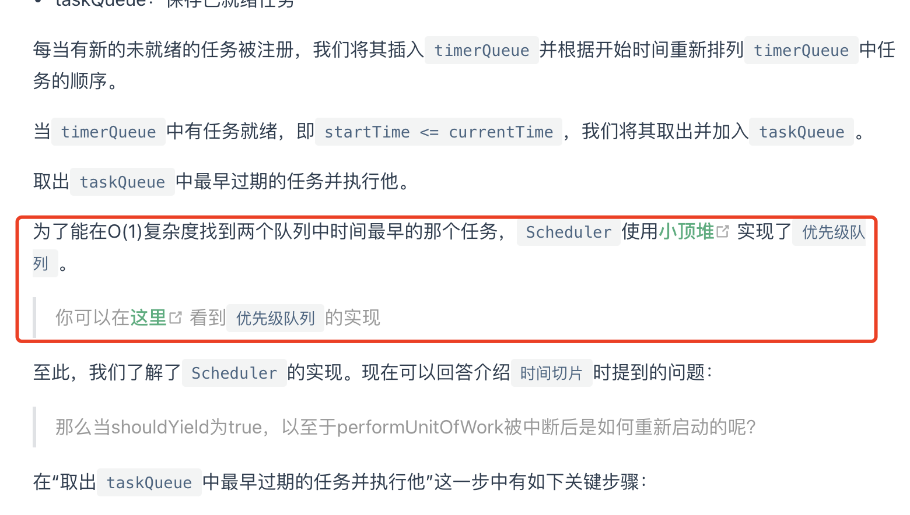

记录这点内容是因为在 ReactJS 中，为了能在O(1)复杂度找到两个队列中时间最早的那个任务，Scheduler使用小顶堆实现了优先级队列。[具体内容](https://react.iamkasong.com/concurrent/scheduler.html#%E4%B8%8D%E5%90%8C%E4%BC%98%E5%85%88%E7%BA%A7%E4%BB%BB%E5%8A%A1%E7%9A%84%E6%8E%92%E5%BA%8F)



注：以下内容是完成了所有的排序，在 ReactJS 中，只需完成一轮排序，找出优先级最大的那个任务就行。

[大堆顶介绍文章](https://www.cnblogs.com/lanhaicode/p/10546257.html)
```js
let a = [7, 3, 8, 4, 9, 10, 12, 11, 5, 1, 2];
console.log(a);
function sort(heap) {
  for (let length = heap.length; length > 0; length--) {
    for (let index = Math.round(length / 2) - 1; index >= 0; index--) {
      compare(heap, index, index * 2 + 1, length, true);
      if (compare(heap, index, index * 2 + 2, length, true)) {
        compare(heap, index, index * 2 + 1, length, true);
      }
    }

    compare(heap, 0, length - 1, length, false);
  }
}

function compare(heap, a, b, length, flag) {
  if (!heap[b] || b >= length) {
    return false;
  }
  if (flag ? heap[a] < heap[b] : heap[a] > heap[b]) {
    const temp = heap[a];
    heap[a] = heap[b];
    heap[b] = temp;
    return (
      compare(heap, b, 2 * b + 1, length, true) ||
      compare(heap, b, 2 * b + 2, length, true)
    );
  }
  return false;
}

sort(a);

console.log(a);
```
